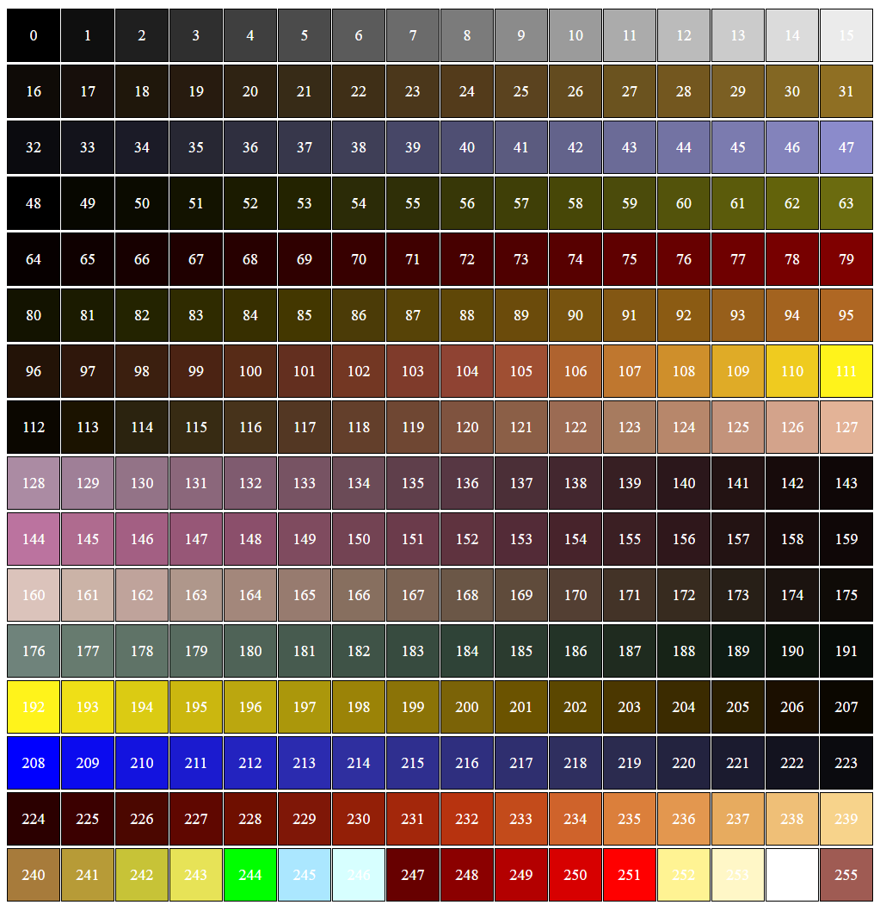

# GoldSrc Palette Viewer

A dead simple web-based tool to view the `palette.lmp` file used in GoldSrc-based games (like Half-Life, Counter-Strike 1.6, etc).

This file is commonly located in:
- `valve/gfx/palette.lmp`
- `cstrike/gfx/palette.lmp`
- Or other mod folders inside `gfx/`

## Why?

GoldSrc games use a 256-color palette (`palette.lmp`) mainly used in legacy particle effects like blood, sparks, tracers, and more.

Sometimes you just want to quickly check what the palette looks like — and this tool lets you do that right in your browser.

## How to use

1. Clone or download this repository.
2. Open `index.html` in any modern browser (Chrome, Firefox, etc).
3. Upload a `palette.lmp` file using the file input.
4. Instantly see the color blocks rendered with their palette indices.

That’s it. No need for any installs or tools.

## Screenshot

